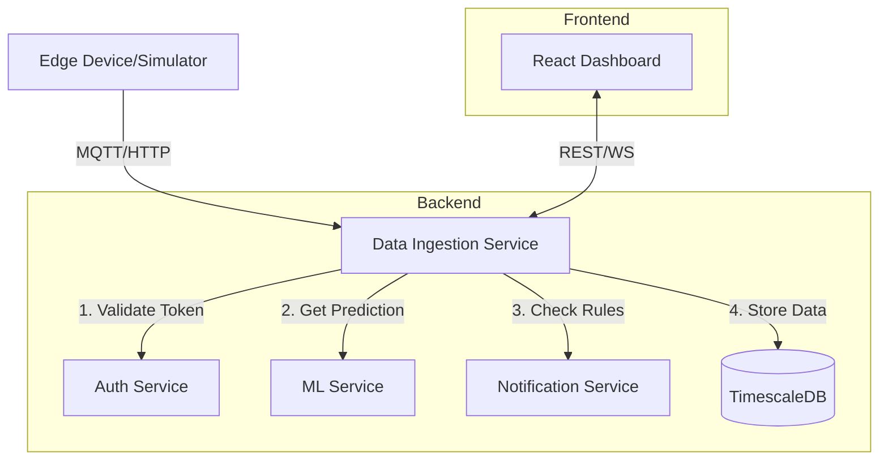

# Phase 6 - System Integration & Data Ingestion

## 🎯 Goal
Connect all isolated services into a cohesive, flowing system. The core piece missing is the **Data Ingestion Service**, which acts as the traffic controller—receiving raw data from devices, authenticating it, enriching it with ML predictions, checking for alerts, and serving it to the frontend.

## 🏗️ Architecture

## 📋 Deliverables

### 1. Data Ingestion Service (Node.js/TypeScript)
- **Tech Stack**: Express, Socket.io, pg (Postgres), MQTT.js, Axios
- **Responsibilities**:
    - **MQTT Broker Interface**: Subscribe to `ecotronics/devices/+/readings`
    - **HTTP Endpoint**: `POST /api/v1/ingest` (fallback)
    - **Authentication**: Validate device API keys via Auth Service
    - **ML Integration**: Call `POST /api/v1/ml/predict/anomaly`
    - **Rule Evaluation**: Call `POST /api/v1/rules/evaluate`
    - **Storage**: Insert into `sensor_readings` hypertable
    - **Real-time Push**: Emit `new_reading` events via Socket.io

### 2. Frontend Integration
- **Socket.io Client**: Connect frontend dashboards to real-time stream
- **API Clients**: Replace mock data calls with real backend endpoints:
    - `/api/v1/devices/:id/readings/history`
    - `/api/v1/notifications/alerts`

### 3. Database Schema (TimescaleDB)
- Ensure `sensor_readings` table exists and is optimized for time-series.
- Ensure `alerts` and `audit_logs` tables map to Notification Service needs.

## 📅 Implementation Plan

### Step 1: Data Ingestion Service Setup
- Initialize `backend/data-ingestion-service`
- Setup Express app & MQTT client
- Create Database connection (Prisma or raw pg)

### Step 2: The "Ingestion Pipeline"
- Implement the flow:
  `Raw Data` -> `Auth Check` -> `ML Anomaly Check` -> `Rules Check` -> `DB Insert` -> `Socket Emit`

### Step 3: Frontend Connection
- Update React app to use `socket.io-client`
- Replace demo charts with real data listeners

## 📊 Success Metrics
- **E2E Latency**: < 500ms from Device to Dashboard
- **Throughput**: Handle 100 concurrent device streams
- **Reliability**: Zero data loss during ingestion
